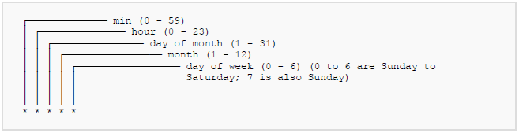

This talk is structured so you can follow a long.

---

## APScheduler


APScheduler has three built-in scheduling systems you can use:

Cron-style scheduling (with optional start/end times)

Interval-based execution (runs jobs on even intervals, with optional start/end times)

One-off delayed execution (runs jobs once, on a set date/time)


---


#### tl;dr schedule your python code to run later.

---


## Crons

daily payments tasks

recurring report generation

automated backups

---





---

## Simple Example

```sh
mkdir apsched && cd appsched
python3 -m venv venv
pip install apscheduler
vim simple.py
```

---

Basic BG scheduler

```python
from apscheduler.schedulers.background 
     import BackgroundScheduler

scheduler = BackgroundScheduler(daemon=True)
scheduler.add_job(lambda: scheduler.print_jobs(), 
    'interval', seconds=5)
scheduler.start()
```
---


What's wrong here?

---


This is essentially the same as BlockScheduler


---


## APScheduler Components

---


<em><small>source: https://enqueuezero.com/concrete-architecture/apscheduler.html</small></em>

---

# Job

Jobs contain a functoin, parameters for execution, and scheduling paramters.
The scheduling parameters are for controlling scheduler behaviors.

---

# Trigger

All jobs have their own triggers. Triggers determine when the next time a given job should run. 

---

# Scheduler

The scheduler is the master coordinator. It manages the execture and the job store. There are a number of subclasses for specific use.


---

### Scheduler

Offers a couple of scheduling schemes:

1. cron style
2. interval based
3. One off/delayed execution

---

# JobStore
JobStore houses the scheduled jobs. Saved in memory by default. You can supply other persitence sources such as Mongo, Redis, etc...


---

# Executor
Executors run the jobs. They manage the life cycles of jobs. By default, you can use thread or process as executors.


---

see main.py